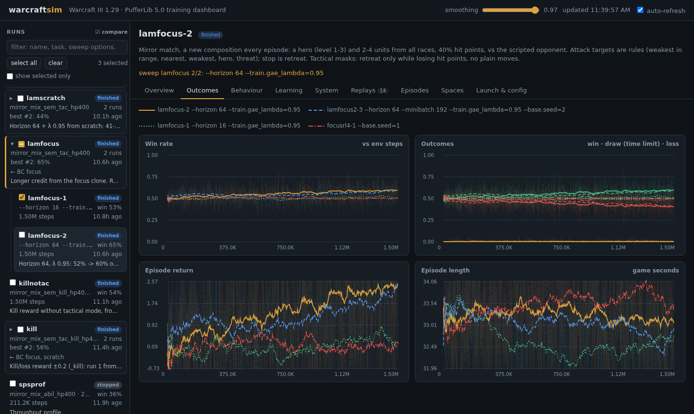

# warcraftsim

Headless Warcraft III for reinforcement learning: the **real game** (Legacy TFT 1.29.2, Blizzard's
offline client) under Wine in Ubuntu/WSL2, driven step by step from Python. There is no renderer
window, no Battle.net and no human input, and it runs much faster than real time.

This repository contains no Blizzard game files: you need your own copy of Warcraft III: The Frozen
Throne (Legacy 1.29). The tools read its archives and build the maps they use locally. Replays and
videos of your runs stay in `runs/`, which is not committed. warcraftsim is not affiliated with or
endorsed by Blizzard Entertainment.

https://github.com/user-attachments/assets/0ba228f2-3a16-411d-b0e8-685246f05764

*The league policy `genleague5d` (A, green rings), trained by self-play with hero abilities, against its predecessor `genleague3`
(B, orange rings), which never learned to cast, in a 5 v 5 mirror match: a Lich and four units a side. Both sides focus their attacks
on the enemy Lich, and A kills B's first. A's Lich casts Frost Armor and Frost Nova until its mana runs out, and A wins with three
units left. Over 120 games `genleague5d` beat `genleague3` 81–31. The panel on the right shows what each policy saw and thought:
value estimates, rewards, team hit points, the Liches' mana and spells, and every unit's action probabilities.*

```python
from warcraftsim import Wc3Game, GameSetup, Agent, BuiltinAI

with Wc3Game(GameSetup(map="(2)EchoIsles", slots=[Agent("human"), BuiltinAI("orc", "insane")])) as game:
    obs = game.reset()                       # game time 0
    while not obs.game_over:
        for worker in game.idle_workers():
            game.harvest(worker, game.nearest_mine(worker))
        obs = game.step()                    # 0.25 s of game time
    print(obs.players[0].result)
```

<p align="center"></p>

*The training dashboard comparing four runs from the same starting point: with horizon 64 (orange, blue) the return keeps
rising, with horizon 16 (green, red) it doesn't (see [experiments](docs/experiments.md#the-horizon)).*

## How it works

```
Python (warcraftsim)                 Wine prefix per game                 Warcraft III 1.29 process
------------------------------       -------------------------------      -------------------------------------
Wc3Game / Wc3Env / Wc3VecEnv          .wgc game config (slots, AI)  --->   map = stock map + injected JASS harness
GameInstance ── TCP 127.0.0.1 ──────────────────────────────────────────── w3shim.dll (injected by w3launch.exe)
     │  observations and commands travel with the step sync:              - virtual clock (game runs N x faster)
     │  "OBS n len" + tokens  ->   <- "GO ... A n ints"                    - blocks the game at every step
     └──────────────────────────────────────────────────────────────────── harness: Preload() observation tokens
                                                                              (captured by the shim), mailbox native
                                                                              for commands
```

* **Harness** (`warcraftsim/harness/w3sim.j`): JASS injected into the map script by
  `data/mapbuild.py`. On every step (a game-time timer) it:
  1. writes an observation: players, changed units, events and command results;
  2. reads the next commands through a mailbox native the shim answers;
  3. issues them with ordinary order natives (`IssuePointOrderById`, ...).

  Its other jobs:
  * It suppresses the built-in AI for agent slots.
  * It decides wins and losses without ending the session.
  * It runs scenarios.
* **w3shim.dll** (`shim/`, mingw, 32-bit). It is injected into the game by `w3launch.exe`, and all its hooks are in the game's import table or a few engine functions:
  * **Virtual clock:** replaces the game's timers (QPC, GetTickCount, FILETIME, rdtsc helper) and scales its waits, so the game runs as fast as the CPU allows.
  * **Step sync:** when the harness calls its mailbox native, the DLL freezes the clock, sends the observation over TCP ("OBS") and waits for "GO" with the next commands. That makes stepping exactly synchronous and deterministic in game time.
  * **Frame capture and audio** for videos (see Watching games).
* **`.wgc` game configs** start a local game directly, with no menus or Battle.net. They set the map, the slots (agents are computer slots with no AI; built-in AIs get easy/normal/insane) and an observer as the local player.

## Setup (once)

1. **Install Warcraft III - Legacy TFT 1.29** from the Battle.net app (Warcraft III → Game Version dropdown), then copy it into WSL:
   ```bash
   rsync -a --exclude .battle.net --exclude Data "/mnt/d/Warcraft III (Legacy)/" ~/wc3/legacy-1.29/
   ```
   To use another location, set `WC3_GAME_DIR`.
2. **Install system packages** (WineHQ, Xvfb, mingw, ...):
   ```bash
   sudo bash scripts/setup_system.sh        # WineHQ stable (11.0); staging measured slower here
   ```
3. **Build the native helpers and create the Python venv:**
   ```bash
   git submodule update --init
   python3 -m venv .venv && .venv/bin/pip install cmake && .venv/bin/pip install -e ".[rl,video,dev]"
   scripts/build_native.sh     # StormLib (MPQ), pjass (JASS checker)
   make -C shim                # w3shim.dll, w3launch.exe
   .venv/bin/python -m warcraftsim setup
   ```

## Usage

| | |
|---|---|
| `python -m warcraftsim ai-vs-ai --difficulty insane` | Two built-in AIs play a full game headless. |
| `python -m warcraftsim play --difficulty easy` | The scripted Human bot plays the built-in AI. |
| `python -m warcraftsim scenario` | Micro skirmish against the scripted opponent. |
| `python -m warcraftsim bench -n 8` | Parallel throughput. |

### Python API

* **`GameSetup`:** map, slots, `step_seconds`, `speed` (clock multiplier; adaptive by default), `max_game_seconds`, `fog`, `scenario`, `warm_spare` (melee: keep a loaded spare game so `restart()` takes about 1 s).
* **Slots:**
  * `Agent(race)`: controlled from Python.
  * `BuiltinAI(race, "easy"|"normal"|"insane")`: Blizzard's melee AI.
  * `Scripted(race)`: scenario opponent that attack-moves to the nearest enemy.
  * `Idle(race)`: no controller.
* **`Wc3Game`:**
  * `reset()` and `step(commands)`.
  * Queued order helpers: `move`, `attack`, `attack_move`, `smart`, `stop`, `hold`, `harvest`, `harvest_tree`, `train` / `research` / `upgrade`, `build`, `learn`, `cast`, `use_item`.
  * `cast()` accepts an order string (`"thunderbolt"`) or an ability code (`"AHtb"`). All ability order strings in the game data are resolved in the first observation.
  * Heroes report each ability slot's level and cooldown left (`Unit.abilities`, in the order of `data.abilities.hero_abilities()`). `data.abilities.ability_info()` has each hero ability's name, order, how it is cast (unit / point / instant / passive), whom it is for, and its mana, cooldown, range and area per level. Queued heroes learn skills with `QueueSpawn(..., skills=("AHtb", "AHtb", "AHtc"))`.
  * Debug commands: `spawn`, `set_resources`.
  * Queries: `my_units`, `idle_workers`, `mines`, `enemies`.
* **`Observation`:**
  * `players` (gold, lumber, food, upkeep, result, ...).
  * `units`: every unit with id, type, owner, position, facing, hp/mana, current order, flags (hero, structure, worker, constructing, hidden, ...) and per-agent visibility.
  * `events`: deaths, training, research, construction, spells, tree deaths.
  * `command_results`.
  * On the first observation only: `destructables` and the `orders` table.
* **Gymnasium** (`warcraftsim.env`):
  * `Wc3Env`: feature arrays; actions are lists of commands.
  * `MicroEnv`: scenario fights, with a MultiDiscrete action per unit.
  * `NavigateEnv`: move a unit to a target.
  * `MicroSelfPlayEnv`: two policies fight each other (PettingZoo-style dicts per player, zero-sum reward).
* **`warcraftsim.vec.Wc3VecEnv`:** N games in parallel with auto-reset.
* **Self-play in full games:** use two `Agent` slots. `game.as_player(1)` returns a handle whose helpers and queries act as player 1; orders from all handles go out with the next `step()`.

### Watching games

The game runs headless, so there are two ways to see what happened:

* **Trajectories (any game).** `warcraftsim.record.TrajectoryRecorder` saves the observation stream to a `.jsonl` file. `python -m warcraftsim view ep.jsonl` renders it as a self-contained HTML animation: units over the map's walkable area, with HP bars, player stats, play/pause and a time slider.
  `play` and `scenario` take `--record DIR`.
* **Replays and videos.** `GameInstance.save_replay(path)` ends the game normally and saves two files: the `.w3g` replay the engine writes, and `path.commands.json`, the agent orders per step.
  * Agent orders are issued by the map script, not through the engine's recorded command stream. So the stock 1.29 client shows the built-in AI's play correctly but not the agents'.
  * `GameInstance.play_replay(path)` plays the replay back through the harness and feeds the logged orders in at the same steps, reproducing the game exactly (verified step by step).
  * `warcraftsim.video.render_replay(setup, path, "ep.mp4")` records that playback as real game footage with the game's sound: MP4 at 40 fps in real time by default, optionally following a player's units.
    * The shim switches the game clock to frame-stepped mode, so every rendered frame advances the game by exactly 25 ms, one engine turn.
    * Each frame is grabbed from the virtual display before the game continues.
    * The result is smooth and independent of machine load. A 60 s episode renders in about 60–75 s next to a training run.
    * **Audio** comes from a virtual sound card in the shim (`shim/audio.c`, `GameSetup.audio`):
      * The game mixes its sound with Miles, which outputs through `waveOut`; the shim implements those functions.
      * Each captured frame takes exactly one frame's worth (25 ms) of mixed audio from Miles's queue, so sound follows the picture however fast the render runs.
      * Miles mixes ahead of playback. The shim lowers its buffering (preferences 11 and 45: about 55 ms instead of about 180 ms) and reports the remaining queue; the soundtrack is shifted earlier by that amount.
      * Audio renders run at no more than real time, because Miles's mixer runs on real time. If it falls behind, the gap is padded with silence and the late audio is dropped, so the soundtrack stays in sync.
      * `music_volume` sets the music level (default 40, 0 for none). Training games have no sound device.
* **Screenshots.** `instance.screenshot(path)` saves the virtual display. In scenarios the camera is centered on the action.

### Scenarios (fast RL iteration)

```python
from warcraftsim import GameSetup, Agent, Scripted, Scenario
Scenario.skirmish(["hfoo"] * 4, ["ogru"] * 3)            # last side standing wins
Scenario.move_to_target("hfoo", distance=1200)           # navigation, success judged in Python
Scenario(units=(SpawnSpec(0, "hfoo", -300, 0), ...), victory="elimination", max_game_seconds=60)
```

A scenario:
* removes every pre-placed unit;
* clears trees around its center;
* spawns its units.

The default scenario map is `"flat"`: a generated 32×32-tile (4096×4096) level plane with no water, cliffs or trees, centered at (0, 0), with the camera on the action.
* `"flatN"` gives an N×N-tile plane.
* `"flat:(2)EchoIsles"` gives a full-size flat version of a stock map.
* Any stock map name also works; its most open walkable spot becomes the center.

`reset()` re-spawns them inside the running game in about 10 ms, so there's no reload.

## Training with PufferLib 5.0 and the dashboard

PufferLib 5.0 (`third_party/PufferLib`, the current `5.0` branch) is a native CUDA trainer, and its environments are C code compiled into the `puffer` binary. The pieces:
* **C environment** (`puffer/wc3_bridge.h`): each environment is one Warcraft III game, reached through a bridge.
* **Bridge** (`warcraftsim/puffer/bridge.py`): a Python server that runs the games and serves them to the trainer over a Unix socket. Every trainer environment gets its own game thread.
* **Tasks** (`warcraftsim/puffer/tasks.py`): fixed-size observations and actions for PufferLib. The C header is generated from them.

```bash
# needs the CUDA toolkit (nvcc), clang, ccache, NCCL, libomp:
#   sudo apt-get install ccache libnccl2 libnccl-dev libomp-14-dev libomp5-14 libgl-dev libx11-dev
python -m warcraftsim.puffer.train --task nav --timesteps 400000                  # navigation
python -m warcraftsim.puffer.train --task footmen2 --step-seconds 0.5 --timesteps 400000 \
    --lr 0.01 --minibatch 192 --replay-ratio 4                                     # 2 v 2 footmen: 95% wins in ~1.5 min
python -m warcraftsim.puffer.train --task micro_mirror --timesteps 3000000        # 4 v 4 footmen
python -m warcraftsim.puffer.train --task selfplay_micro --envs 8 --timesteps 3000000 # both sides learn
# a sweep: the games launch once, then one run per --sweep (runs NAME-1, NAME-2, ... in the dashboard)
python -m warcraftsim.puffer.train --task footmen2 --name f2 --timesteps 1e6 --sweep "--lr 0.01" --sweep "--lr 0.02"
# notes: what a run tests (runs/<name>/notes.md; editable in the dashboard); in a --sweep, for that run
python -m warcraftsim.puffer.train --task footmen2 --name f2 --note "lr sweep" --sweep "--lr 0.01 --note 'seed 1'"
python -m warcraftsim dashboard                                                    # http://localhost:8765 (--host 0.0.0.0: from other machines)
```

Tasks (add more in `tasks.py`; `scripts/baselines.py` measures scripted policies on any of them):
* `nav`: reach a point.
* `footmen2`: 2 vs 2 footmen with 100 hit points against the scripted opponent (episodes ~17 s). With its tuned settings, 95% wins after ~0.2M steps (~1.5 min).
* `footmen<N>v<M>[_hp<HP>][_ehp<EHP>]`: N agent footmen against M scripted ones with HP hit points each (default 100), the enemies EHP (a handicap).
* `micro`: 4 footmen vs 3 scripted grunts. This is hard: scripted baselines win about 1 game in 3.
* `micro_mirror`: 4 vs 4 footmen against the scripted opponent.
* `selfplay_micro`: 4 vs 4 footmen with both sides served to the trainer as agents of the same policy. `--envs` counts games, so each game gives two agents. The dashboard's win rate is side 0's.
* `mirror_mix[_sem][_abil][_rel][_tac][_rejoin][_kill][_self][_hp<P>][_units]`: a mirror match with a new random composition every episode: a hero (level 1-3) and 2-4 units from all races (footman, rifleman, knight, grunt, headhunter, tauren, ghoul, crypt fiend, abomination, archer, huntress), the same on both sides. Unit features include the type's range, DPS, armor, speed and cooldown (`data.objects.combat_stats`); episodes are spawned through `QueueSpawn` + `Restart` (`Wc3Game.reset(spawns=...)`).
  * `_hp<P>`: P‰ of the units' hit points (default 250). With more hit points micro matters more; `_hp400` is the training setting (noop wins 54%, focus fire plus pulling hurt units back 80%).
  * `_sem`: the target head picks a rule instead of an enemy slot (weakest in range, nearest, weakest, hero, threat = DPS per hit point left) and stop becomes retreat (straight away from the nearest enemy), so an order means the same whatever the composition (`MicroEnv(targeting="semantic")`).
  * `_abil` (implies `_sem`): heroes fight with their abilities. Each hero gets a random skill build for its level (fighting abilities only: no summons, far sight, blink or sacrifices), the same on both sides. Each unit has a fourth action head, the ability slot, and a fifth kind, cast; the target rules pick an enemy within the ability's cast range, or an own unit for heals and buffs; instant abilities need no target. Units get 10 more features per ability slot (level, ready, cooldown, how it is cast, for whom, range, area). The scripted opponent's heroes cast what `MicroEnv.scripted_cast` picks.
  * `_rel`: relational unit features (nearest opponent, opponents in reach, threatened, weakest, time to die).
  * `_tac`: tactical mode. No plain moves; a retreat only for a unit below half its hit points that is losing them; a chosen retreat goes on while the unit keeps losing hit points (at most 3 s), so one decision is the whole pull-back.
  * `_rejoin` (implies `_tac`): when a pull-back ends and the unit is told nothing, it attack-moves back into the fight.
  * `_kill`: ±0.2 reward per enemy killed / own unit lost.
  * `_self`: self-play (`MirrorSelfPlayEnv`): the policy plays both sides. With PufferLib's self-play pool (`--selfplay.enabled=1 --vec.num_policies=2 --vec.hist_policy_percent=0.5`), part of the games are against past checkpoints.
  * `_units`: one agent per unit, all with the same policy.

  Scripted policies for baselines and demonstrations (`agents/micro.py`): `noop`, `focus`, `range`, `sticky`, `[base]pull<L>[p<P>]` (pull a hurt unit back below L% hit points, with probability P), `cast<policy>` and `smartcast<policy>` (heroes cast too).

What we found (details, tables and the runs behind them: [docs/experiments.md](docs/experiments.md)):
* Sweeps made learning much faster: `footmen2` reaches 95% wins in ~1.5 min; on the ability task the tuned settings (horizon 16, λ 0.8, clip 0.3) reach 30% wins after 0.1M steps instead of 0.66M.
* On the mirror matches, PPO from scratch ends near "let the units fight on their own". Team tactics (focus fire plus pulling hurt units back) don't emerge from random exploration, because either half alone doesn't pay.
* Starting from a fitted script (behavior cloning) fixes that: PPO keeps the script's tactics and sharpens them (the fitted `pull35`: 58% → 66-73%).
* Longer credit (horizon 64, λ 0.95) lets PPO discover pull-backs from a fitted focus-fire script (50% → 60%; forbidding retreats costs it 12 points), which horizon 16 never did.
* With general orders and the entity network (`--trainer torch`), a fitted `pull35` fine-tuned gently (a low learning rate, the value trained first, small steps) reaches **91%** against the scripted opponent, far past the script (71%). It keeps the script's pull-backs and focus fire, but picks its own focus target: often the most damaged enemy by share of hit points, often the hero, instead of the one with the fewest hit points.
* The same recipe with hero abilities reaches 68-69% against the casting scripted opponent (the fitted script: 51%; PufferLib's network never passed 52%).
* League self-play (AlphaStar-style: itself, past snapshots chosen by PFSP, scripted anchors) first learned to run away: it beat its past selves and the 91% policy but won 4% against an opponent that chases. With draws counting as losses and an anchor that chases like the scripted opponent, the league policy wins 82% against the scripted opponent and beats the 91% policy 79% head-to-head.

Warm start from a script (behavior cloning, `puffer/bc.py`):
```bash
python -m warcraftsim.puffer.bc collect mirror_mix_sem_hp400 --policy pull35 --episodes 2000 --games 8  # ~5 min
python -m warcraftsim.puffer.bc fit runs/bc/mirror_mix_sem_hp400-pull35        # torch; ~4 min on the GPU
python -m warcraftsim.puffer.bc eval mirror_mix_sem_hp400 runs/bc/mirror_mix_sem_hp400-pull35/policy.bin
python -m warcraftsim.puffer.train --task mirror_mix_sem_hp400 --lr 0.001 \
    --init-from runs/bc/mirror_mix_sem_hp400-pull35/policy.bin ...
```
* `collect` plays a scripted policy (`agents/micro.py`) in games set up like the trainer's and saves the observations, actions, action masks, scaled rewards and which unit slots were alive.
* `fit` trains PufferLib's network (linear encoder, MinGRU layers, a linear decoder with the value as its last output) in torch and writes its weight file. It needs torch, which is not in the venv: it runs with `WC3_TORCH_PYTHON` or the first Python that has it.
  * Direction and target heads count only on steps where the unit moved or attacked.
  * Label smoothing (0.1) keeps every choice possible, so PPO can still try what the script never does.
  * A small value weight (0.005) matters. The returns are noisy, and at 0.05 the value took over the shared layers: retreat recall was 0.11 instead of 0.82.
* `eval` plays a checkpoint (sampled, or `--greedy`; `--forbid retreat` masks an order kind) and records the result with the dataset or run it belongs to.

### General orders, entity networks and league self-play (`--trainer torch`)

The tasks above give PufferLib's network built-in tactics (a retreat order, target rules like "weakest"). `mirror_mix_gen*` tasks use general orders instead, closer to what a player can do, as in AlphaStar and OpenAI Five. Per unit:
* an order kind: noop, stop, hold, move, attack, attack-move or cast;
* for move and attack-move, a direction (16) and a distance (150, 350 or 700);
* for attack and cast, a pointer at any unit slot (own slots, then the enemy's);
* for cast, an ability slot.

Masks rule out only what is impossible, and the game handles the rest (a target out of range: the unit walks there first). A pull-back is a move away, focus fire is every unit attacking the same slot. The scripts speak these orders too (`pull35`: 71%, the same as with the built-in retreat).

PufferLib 5's native trainer fixes the network to encoder → MinGRU → decoder, so pointing at units needs our own trainer, `warcraftsim/rl` (PyTorch; it runs with the torch Python, like the behavior cloning fit):
* **EntityNet** (`rl/model.py`): each unit is a token (a shared MLP, then a transformer over all units), a GRU core carries memory, and each own unit's orders are sampled autoregressively: kind → ability → target (the unit's query against every unit's key) → direction and distance. A head counts in the action's probability only when the chosen kind uses it.
* **PPO** (`rl/ppo.py`): normalized advantages, updates on sequence chunks, the rollout step compiled with CUDA graphs (20 → 2 ms), a KL term to a reference policy (`--torch.ref=... --torch.ref_kl=0.1`, as AlphaStar keeps near its supervised policy), value warmup and a KL target for fine-tuning a clone, an evaluation-only mode.
* **League** (`rl/league.py`) for self-play tasks (`mirror_mix_gen_self*`): the learner plays side 0 of every game; side 1 is itself (both sides' experience trains it), a past snapshot chosen by prioritized fictitious self-play (the ones it beats less, more often), or a scripted anchor (noop, focus, pull35, amove) that doesn't drift with the league. Win rates by opponent go to the dashboard's League tab.
  * `--torch.exploiters=1` adds an AlphaStar main exploiter: a quarter of the games are its games against the main learner's current policy; its snapshots join the league, and it starts over from the initial policy once it wins 70%.
* **Match runs** pit two policies against each other and record every episode as a replay and a video, e.g. to watch trained policies:
  `python -m warcraftsim.match genleague3 genft-1 --episodes 20` (players: a run's latest checkpoint, a checkpoint file, `bc/<dataset>`, or a script such as `script:amove`). They swap sides every episode; the dashboard shows the score and the videos.

```bash
python -m warcraftsim.puffer.bc collect mirror_mix_gen_hp400 --policy pull35 --episodes 2000 --games 12
python -m warcraftsim.puffer.bc fit runs/bc/mirror_mix_gen_hp400-pull35 --model entity     # policy.pt
python -m warcraftsim.puffer.train --trainer torch --task mirror_mix_gen_hp400 --horizon 64 \
    --init-from runs/bc/mirror_mix_gen_hp400-pull35/policy.pt --lr 0.0001 --torch.vf_warmup=10 --torch.target_kl=0.02
python -m warcraftsim.puffer.train --trainer torch --task mirror_mix_gen_self_hp400 --horizon 64 \
    --init-from runs/bc/mirror_mix_gen_hp400-pull35/policy.pt ...                              # league self-play
```

Notes:
* Action masks: a task can say which options of each action head are possible right now (`Task.action_mask`). The bridge sends them with every observation, and PufferLib samples and trains with them. Micro tasks mask attacks on empty enemy slots (slot targeting), casts that aren't possible, and the tactical-mode rules.
* Updates per epoch are `replay_ratio × batch / minibatch`; the minibatch must be a multiple of the horizon.
* PufferLib 5.0 does not normalize advantages, and the micro rewards per step are small. Two settings keep the entropy bonus of the many action heads from outweighing the reward and pushing the policy to uniform:
  * `--ent-coef` defaults to 0.001;
  * micro tasks scale rewards by 10 (`Task.reward_scale`; logged returns are scaled too).
* The KL per update grows with the number of action heads at a given learning rate: lr 0.01 suits `footmen2` (6 heads) but is far too high for 15 heads; use 0.003 or less there.
* Runs can train concurrently. Each run claims a machine-wide training slot, and its games are named after that slot, so consecutive runs reuse their Wine prefixes.

Each run writes `runs/<name>/`, which the dashboard shows live:
* `run.json`: configuration and status, and how it was launched: the command line, the equivalent command for this run alone (a sweep's run with its own options), the git commit (and whether there were uncommitted changes), and which options came from the task's defaults.
* `notes.md`: notes (`--note`, or written in the dashboard).
* `train.jsonl`: one line per trainer epoch (SPS, losses, win rate), from a small patch applied to the build copy.
* `episodes.jsonl`: every finished episode.
* `renders/`: trajectory animations.
* `replays/` and `videos/`: single-episode replays rendered to real game footage in the background (40 fps).
  * The game itself draws which units are the agent's (rings and slot labels A0, A1, ...; enemies E0, ...) and each step's orders: dotted lines to where a unit moves or whom it attacks, a ring at the end, stop markers, and casts (the ability's name, a line to its target and its area). The harness keeps the markers on the units, so they stay aligned wherever the camera goes; the game's own health and mana bars show every unit's state.
    * The markers come from a pool the harness makes at map init (images and texttags), the same in the recorded game and in its playback: an object made only during playback would take a handle id, and later units' ids (which the replayed orders refer to) would no longer match.
    * Replays recorded before this (harnesses without the markers) get the older overlay drawn onto the footage, with drawn bars and a square per learned hero ability.
  * A side panel shows what the policy thought. It evaluates the latest checkpoint before the episode (`puffer/policy.py`, numpy) on the observations the agent saw, and plots:
    * the value V(s) against the discounted return that actually followed;
    * reward and TD error per step;
    * team hit points;
    * each hero's level, mana and learned abilities (level, and ready / cooldown seconds / no mana / passive);
    * per unit, the action probabilities and the sampled action;
    * the policy entropy;
    * an outcome card at the end.
  * In self-play both sides are shown.
  * `scripts/calibrate_camera.py` measures the camera projection the drawing uses.
* `checkpoints/`.

The dashboard (`python -m warcraftsim dashboard`) shows:
* the run list: runs, sweeps as collapsible groups (a checkbox compares all of a sweep's runs), and behavior cloning datasets. Each run shows its parent and the first line of its notes; the filter matches names, tasks, sweep options, notes and parents, and toggles list only some kinds (training, self-play, matches, BC micro, BC whole game, demos);
* per run, in tabs:
  * **Overview**: progress cards, notes (editable), and lineage: what it started from (random weights, another run's checkpoint, or a fitted script), the chain back from there, its sweep, and the runs started from it;
  * **Outcomes**: win rate, win/draw/loss, return, episode length;
  * **Behaviour** (from the actions the policy sent): the action mix, targeting (focus fire, attacks on the weakest enemy, invalid targets), damage dealt and taken, kills and losses;
  * **Learning**: value calibration (predicted V(s₀) against the actual return of video episodes), PPO losses, entropy, KL and clip fraction;
  * **System**: throughput, and the trainer's time per epoch;
  * **Replays**: game videos and trajectory renders in one player, with the episodes beside it;
  * **Episodes**: the recent episodes with their combat and action statistics;
  * **Evaluations**: `bc eval` results for its checkpoints;
  * **Spaces**: the observation (its blocks, every feature by name and index), the action heads with their choices, the action masks and the reward;
  * **Checkpoints**: the saved checkpoints, newest first, with the league opponent each one is and its evaluations; copy its path or a command that uses it, or download it (behavior cloning fits: `policy.pt`, `last.pt`);
  * **Launch & config**: the commands (copyable), the git commit, the whole configuration;
* per sweep: its description, where its runs started from, a table of its runs, its launch command;
* per behavior cloning dataset: the demonstrations (outcomes, action mix, combat), the fit per epoch (loss, accuracy, recall and precision per unit order), evaluations, and the runs started from it.

Compared runs share the charts: one colour and line style per run. The tab, the compared runs and the smoothing are part of the link.

Example: `nav` with 16 games went from a 3% to a 62% success rate within 100k steps (about 3 minutes, at about 550 env steps/s).

### Whole games: duel maps and behavior cloning of the built-in AI (`warcraftsim/fullgame`)

After micro, the whole melee game (economy, building, tech, armies, heroes), starting from the built-in AI's play. The plan: small, fast games first, cloning the built-in AI, then RL; the speedups come out once that works.
* **Duel maps** (`data/duelmap.py`, generated on first use):
  * `duel`: 48×48 tiles, two bases 4600 apart (the smallest stock two-player maps are 80×80). The bases copy Echo Isles' main bases (mine distance, a tree wall behind, creep camps away from the bases), so the built-in AI plays as it does there.
  * `duelfast`: hit points and costs halved, build, train and research times cut to a third.
  * `duelrush`: a faster version of the whole game, games of about 2 minutes. Everything that takes time runs 7× faster: attacks, casts, cooldowns, production, day and night, the gameplay constants that are times, and the waits in the built-in AI's scripts (overriding copies in the map). Movement can't: the engine stops units at 522, so units move 1.3× faster and the map is smaller (40 tiles, bases 3000 apart). Hit points, costs and production times are halved, players start with twice the gold and lumber, and the AI attacks main bases from force level 20 and by night. The mines hold 7 times their gold (at 7 times the income a mine would last 3 minutes). Workers that walk their loads home carry 6.5 times the gold and 4 times the lumber: mining speeds up 7 times but walking only 1.3 times, and without this night elf and undead (whose gold needs no walking) beat human and orc almost always (docs/experiments.md).
  * The rules (`duelmap.Rules`) go into the map as the game's own unit, upgrade and ability tables with the rules' values (object data made every load 2 s longer), gameplay constants and AI scripts, so they can be dialed back one by one.
* **Demonstrations** (`fullgame/collect.py`): built-in AI against built-in AI, with every step's state and the orders the AI gave (`GameSetup.record_ai_orders`: the harness records its units' order events). One `.npz` per game. Games of one matchup run in one process, five to a load of the map, each with two players of its own (`--pairs`; see self-play's speed notes); after the fifth the map reloads in the running game (the engine's `RestartGame`), which is faster than a new launch.
* **Takeover games** (`collect.py --policy runs/bc/<fit>/policy.pt`): a clone plays one side for a random number of steps (`--takeover 10-180`); then the built-in AI takes that side over (`protocol.StartAI`: the harness starts the race's melee AI script for the player mid-game) and its orders are recorded from there. These are demonstrations from states the clone reaches, with the built-in AI as the expert (DAgger's idea). The AI's melee scripts build toward target counts, so they carry on from any state. The clone fell behind in its first seconds (a farm late, a barracks twice) into states the AI's own games never show. BC skips the taken-over side's steps before the takeover.
* **Features** (`fullgame/features.py`): what the player saw (its own units first, the enemy's and neutral units it could see), mirrored so its base is on the left, plus resources, supply, time, races, upgrades and each building's production. The labels are the orders each own unit got. The engine's own orders (resume harvesting, autocasts) and harvest orders to workers that already harvest are no decisions and are dropped. Orders the player couldn't pay for at the step are dropped too, and so are train orders that started nothing: the AI retries its train orders until it can afford them, and half its train orders were refused attempts.
* **Model** (`fullgame/model.py`): a transformer over the units, then per own unit an order (or none) and its target. A target is a pointer at a unit or a point: an x bin, then a y bin given x.
  * Orders the player can't pay for at the step are masked (gold, lumber and food, from the game's tables: `fullgame/costs.py`).
  * **Memory** (`--memory`): a minGRU core, as in PufferLib. Its gate depends on the step's input alone, so training computes a sequence's states with a parallel scan: 10 ms instead of 65 ms for a GRU stepped in Python. The heads read the step's token plus a projection of the state. That projection starts at zero, so a network with memory starts as one without.
* **Fit and play**:
  * `fullgame/bc.py` keeps the epoch with the lowest validation loss.
  * With memory it trains on chunks of consecutive steps. Each lane walks through whole game sides and carries its state from chunk to chunk.
  * The value head learns each step's return under self-play's rewards, computed from the recorded games, so self-play doesn't start from an untrained value.
  * `fullgame/play.py` lets the policy play the built-in AI. A worker on its way to build, or building, gets no other orders: picked every step, they cancelled half the clone's builds.
* **Self-play** (`fullgame/selfplay.py`, after AlphaStar): PPO from the cloned policy.
  * Actor processes play the games (8 per process by default). Games of one setup (races, built-in AI or not) run in one process, five to a load of the map.
  * A league: the learner against itself (both sides train), past snapshots (prioritized fictitious self-play) and the built-in AI, a fixed anchor whose win rate is the run's yardstick.
  * **A curriculum against the built-in AI** (`--curriculum 0.75`): games the learner always loses teach little, so each AI difficulty has a level in [0, 1] that moves toward a 50% score (a loss raises it by `--curriculum-step`, a win lowers it, a tie leaves it). From 0 to 0.5 the learner's units get more hit points, up to twice the AI's (its handicap); from 0.5 to 1 the AI also starts late, up to `--curriculum-delay` seconds (its units idle; `protocol.StartAI` hands it the slot). At 0 the game is the real one. `--curriculum-mode` picks the knobs: `hp` (the above), `delay` (the late start alone; the learner learned to rush the idle AI) or `tax` (the AI plays from the start but loses a share of what it gathers, up to `--curriculum-delay` 0.9); `--real-share` of the AI launches play the real game, charted as `script:ai-X (real)` (the yardstick). The League tab charts the levels.
  * Rewards:
    * +1 for a win, -1 for a loss.
    * A tie at the time limit is worth 0.5·tanh(2·material lead).
    * Potential-based shaping on the material lead: what the living units and buildings cost, times their hit points left. It is zero-sum, and the potential returns to 0 at the end, so it only moves credit earlier.
  * Each own unit's decision has its own clipped PPO ratio, and they share the step's advantage.
  * A KL term keeps the policy near the clone, as AlphaStar keeps near its supervised policy. The first updates train only the value head.
  * With memory, the actors carry each agent's state. The learner trains on sequences from the states the actors stored (`--seq-len`). `--memory 1` adds a new core to a clone without one.
  * A game video about every 10 minutes (`--video-every`; the actors take turns; the filmed game runs in a fresh process) with a side panel like the micro videos': the policy's value against the return that followed, rewards, material, economy, the orders of the step, entropy. A separate process renders them.
  * Speed:
    * One inference server process makes every actor's network calls (a pipe per game): whatever arrived while the last round ran goes into the next, each network's call a CUDA graph captured from the eager network, all of a round's calls waited for once. Past snapshots run through one network whose weights are swapped. A round starts at most every 4 ms (`--infer-period-ms`): each one takes the GPU from the learner for a turn.
    * The games run niced, so the Python that answers them gets the CPU first; nobody watches them, so they draw in the game's own thread (`GameSetup.render_threads`, `d3d_thread`).
    * The harness's pass over the units runs in the shim (`shim/units.c`: the game's natives called from C, not from JASS), and observations are parsed in C (`native/w3obs.c`, `GameSetup.native_obs`: no Python object per unit, no GIL).
    * The learner's minibatches hold steps of similar entity counts (`--pad-groups`), so they pad little.
    * **Five games per load of the map** (`--pairs`, `GameSetup.pairs`). A reload per game was a quarter of a game thread's time, and a reset by script for the same players (`--scripted-reset`) is not a new game: the engine keeps counting their removed heroes. So the duel maps are also built for up to five pairs of players. Each game of a load has two players of its own (the controller still sees players 0 and 1), the next pair's game starts 0.1 s after the last one's end, and only the fifth game's end reloads the map (1 s alone). A later pair's first observation is a load's: same units, same orders under way.
    * The queue of trajectories holds one batch: actors faster than the learner wait instead of piling up steps from older policies.
    * `--resume` continues a run; with `--note`, the note says why it was restarted.
* **On the dashboard**:
  * collections (`DEMOS`): games, rate, game lengths, ties, win rates by matchup, and videos of a game every 10 minutes (`--video-every`) to check what was recorded;
  * fits (`BC`): loss, accuracy, order rate and point error per epoch, the collections used, each `play.py` evaluation (win–tie–loss by race and matchup, gold mined, refused orders), and videos of the clone's games (`play.py --videos`, 2 by default);
  * restarts on every chart of steps, as Grafana shows annotations: a dotted line, and at its foot a badge with the restart's note on hover (`run.json` "resumes": when, at which step, from which checkpoint, and the `--note` given with `--resume`, or one written into `run.json` later);
  * self-play runs: the usual run page (outcomes, losses, KL to the clone), the League tab (the win rate against the built-in AI is "script:ai-normal"; the real game by race; the taxes between races; per AI difficulty the curriculum's level and the curriculum games won by matchup, a colour per learner's race and a dash per opponent's), a Matchups tab (win rates as race-by-race tables for the real game, the games against itself, the curriculum games and the games against past snapshots, over recent games or the whole run, with the taxes in force on hover), the videos, and a Production tab: what the learner and the built-in AI train, build and research per game by race, food at one minute, resources on hand, gold and lumber gathered, kills and losses, over training and in tables by kind of game (the real game, curriculum, self-play) and race.

```bash
python -m warcraftsim.fullgame.collect --out runs/fullgame/demos-1 --games 800 --parallel 24 --races all
python3 -m warcraftsim.fullgame.bc --data runs/fullgame/demos-1 --name fullgame-1        # the torch Python
python3 -m warcraftsim.fullgame.play runs/bc/fullgame-1/policy.pt --games 16 --race all --ai-race all
python3 -m warcraftsim.fullgame.selfplay --name fgself-1 --init runs/bc/fullgame-1/policy.pt
```

## Performance (Ryzen 5950X, 32 threads, WSL2, llvmpipe)

| workload | throughput |
|---|---|
| **Melee, AI vs AI, 2 s steps** | 39x real time (25-minute game in 39 s) |
| **Melee, agent vs AI, 0.25 s steps, full observations** | ≈35x per game (≈140 steps/s) |
| **16 melee games in parallel, 0.25 s steps** | ≈250x real time combined (1000 steps/s) |
| **Scenario skirmish (4 v 4), 0.25 s steps** | ≈160x per game (1.5 ms per step); reset in 11 ms |
| **24 skirmish games in parallel (training setup: 320x240 screens)** | ≈4600 env steps/s (≈1160x real time) |
| **PufferLib training, 24 games (micro_mirror)** | ≈3000 agent steps/s (was ≈620 before this round of work) |
| **Demonstrations: built-in AI vs built-in AI on `duelrush`, 24 games in parallel** | ≈2800 games/h with 8 games per process and a reload per game (≈1300/h with a launch per game); with five games per load, 1.55× the reloads' rate (2700 against 1750 games/h next to a training run) |
| **Whole-game self-play (`duelrush`, 32 games, 4 actor processes, a cloning loss next to PPO)** | ≈840 agent steps/s, 2.4 games/s, five games per map load (560 before this round; the learner is the limit, the CPU close behind; see the self-play notes and `docs/experiments.md`) |
| **Game start** | ≈4 s on the duel maps (≈8 s on Echo Isles); 16 games ≈2 min (4 load at a time) |
| **Melee reset** | on the duel maps with `pairs`: 0.1 s to the next pair of players, four times in five; else the map reloads in the running game: ≈1 s on the duel maps (≈5 s with 32 games running), vs ≈4 s for a launch; with `engine_restart=False`, ≈1 s from a warm spare (a second process that loads in the background) |

Where the time went, and what fixed it (`scripts/bench_env.py` measures env steps/s and the CPU per process
and thread kind; `W3SIM_PROFILE=1..3` adds the shim's per-second profile to each game's `shim.log`):
* **Actions** used to go through a file that the harness loaded with `Preloader`. The engine compiled
  that file as JASS on every step, which cost ~7 ms per step and leaked memory. They now travel in the
  shim's `GO` message; the harness reads them through a hooked native (`GetPlayerTechMaxAllowed` on
  mailbox keys).
* **Observations** used to be written by `PreloadGenEnd` to a file, with file-system calls for every
  token (each a wineserver round trip under Wine, plus a registry lookup of the Documents folder). The
  shim now hooks `Preload`/`PreloadGenEnd` and sends the tokens with the step sync.
* **The units' records** were written by the harness in JASS: ~35 native calls and a few hundred
  instructions per unit, every step. The shim now calls the natives itself (`shim/units.c`; they are
  found by name from the code that registers them): 4.0 → 1.5 ms a step with 140 units.
* **Polling threads**: the virtual clock divides wait timeouts by its speed, so game threads that poll
  with 100–1000 ms timeouts spun at 5,000–11,000 wakeups per second, each a wineserver call.
  `GameSetup.wait_floor_ms` (1 ms) stops that.
* **Rendering**: training games run on a 320x240 virtual screen (llvmpipe CPU 5.3 → 1.7 cores for 16
  games); replay videos are still rendered at 960x540.
* **Trainer** (`scripts/bench_train.py` runs the trainer in several configurations on the same games):
  * With 2 buffers, the trainer itself burned 10.7 cores, more than 24 games together. OpenMP threads
    spin at the barrier while the slowest game of their buffer finishes; `OMP_WAIT_POLICY=passive` fixes that.
  * Each buffer waits for its slowest game before its next model call, so train.py now uses one buffer
    per two games.
  * Together: 2150 → 2970 agent steps/s at 24 games.

These numbers are for WineHQ **stable** 11.0, which is picked automatically from `/opt/wine-stable` (override with `WARCRAFTSIM_WINE`). Staging 11.18 was about 25% slower in parallel runs.


Training throughput (`mirror_mix_abil_hp400`, 24 games): the games alone step 3,550 times per second (`scripts/bench_env.py`, random actions), training about 1,830. Measured, and not the limit:
* the CPU: 25 of 32 cores are busy;
* the number of games: 36 give 1,871 steps/s, 48 give 1,751;
* trainer buffers: 12 is best (24: 1,758; 6: 1,743; 4: 1,663; 3: 1,559);
* blocking CUDA sync: 1,756;
* the window: 160x120 is 3% faster than 320x240; rendering takes 1-2 cores in all.

The limit is PufferLib's synchronous rollout. Each buffer thread runs its horizon step by step (inference, then its games), and training waits until every buffer is done. So each epoch lasts as long as the slowest buffer: steps take 6.8 ms (p90 9.6), and an episode reset takes 28 ms (max 52).

The torch trainer (`--trainer torch`, league self-play on `mirror_mix_gen_abil_nodraw_self_hp400`, 24 games) went from 160-180 to about 800 agent steps/s after profiling it with py-spy:
* **The league's opponents** took 62% of the trainer's time: every past snapshot ran its own eager forward (six snapshots: 128 ms per step). They now share one network, compiled once, with each snapshot's weights swapped in by one fused copy on the GPU (5 ms).
* **The compiled policy step** was split into small graphs with eager code between them. Three operators torch.compile can't trace caused this: `nn.GRUCell`'s fused kernel, the transformer's inference fast path, and `torch.distributions.Categorical`. Now the GRU cell runs as plain ops, the fast path is off, and actions come from Gumbel-max sampling. A step takes 0.6 ms instead of 10+.
* **GPU round trips:** each seat copied its observations to the GPU and its actions back on its own, and every copy waits for the GPU. Now there is one pinned upload and one download per step.
* **The PPO update** runs in a thread while the next rollout is collected: the games waited for it, a third of each epoch. Its forward is compiled too (2.3× faster). After two inline updates, compiled code runs "run-only", because torch.compile can't trace in one thread while the other runs compiled code.

What's left, per epoch of 1,664 steps: about 1 s waiting for the games and 0.9 s of inference, with the CPU 57% idle. More games per trainer would use it. The games themselves cost about 19 ms of CPU per step, 40% of it in each game's wineserver.

## Tests

```bash
.venv/bin/pytest                 # unit tests (those that need the game's files or native tools skip without them)
.venv/bin/pytest -m wine         # integration tests: launch real games
```

See `docs/architecture.md` for design notes, limits and what is known about the engine, and
`docs/experiments.md` for the training experiments.

## License

MIT (see `LICENSE`). The submodules in `third_party/` keep their own licenses (PufferLib and StormLib:
MIT; MinHook and pjass: BSD 2-Clause). Warcraft III and its game data belong to Blizzard Entertainment
and are not part of this repository.
