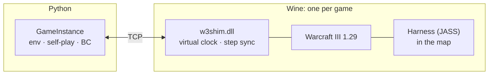
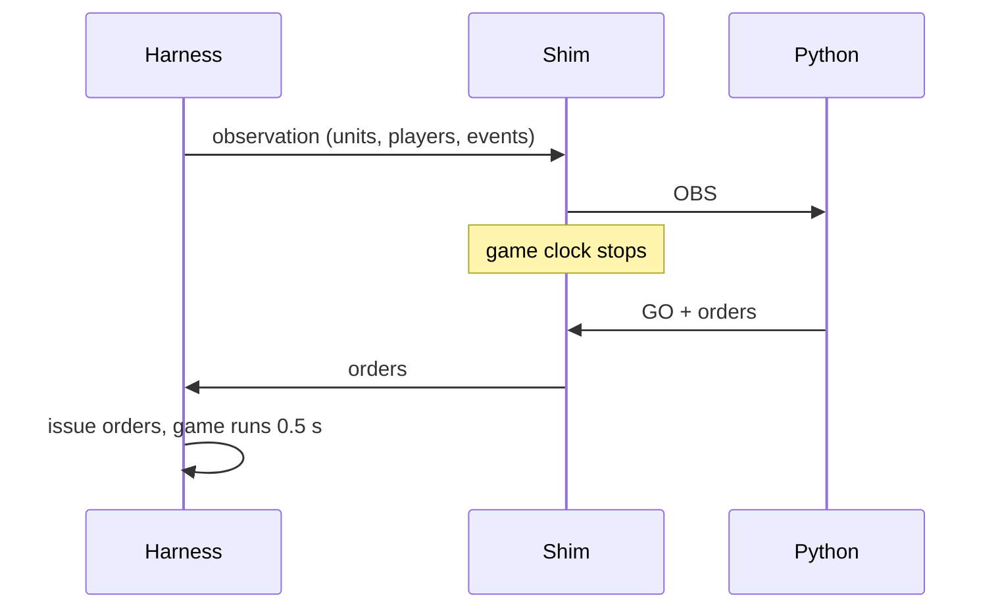

# Architecture

Python drives the real game through a script in the map (the harness) and a DLL in the game process (the shim). The [engine notes](reference/engine-notes.md) have the details.

## The parts

* **The harness** writes each observation and issues the orders with the game's own functions.
* **The shim** runs the game's clock as fast as the CPU allows and stops the game at each step.
* **The `.wgc` file** starts a game with no menus: the map, the slots and the built-in AI levels.

## One step

## Rules to remember

* A reload by `RestartGame` gives a new game. A reset by script does not: the engine keeps counting removed heroes.
* The game runs only as the 32-bit Legacy 1.29 build. The shim's offsets are for that build.
