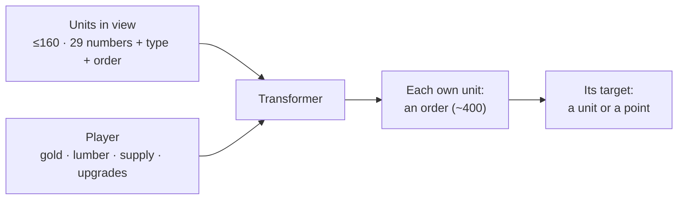

# Environments

Every environment is the real game. The maps get smaller and faster rules so that a game takes minutes, not half an hour.

## Maps

| map | size | built-in AI games | strongest race |
|---|---|---|---|
| `duelrush` | 40 tiles | 2.1 min | night elf 78% |
| `duelfast` | 48 tiles | 6.3 min | night elf 71% |
| `duel` | 48 tiles | 12.4 min, 42% ties | orc 52% |

All duel maps have two bases like Echo Isles' main bases, a gold mine each and creep camps. They have no expansions, items or shops.

## Micro tasks

Small fights on a flat map, against a scripted opponent or the policy itself. A reset takes 10 ms.

## What the agent sees and does

* The view follows the fog of war. The agent sees enemies only while they are in sight.
* The agent does not see terrain, trees or buildings it saw earlier.
* [The whole-game model](model.md) shows the tokens, the transformer and the action heads.

## Opponents

* **The built-in AI** (easy, normal, insane). The real game against it is the yardstick.
* **A curriculum**: the AI loses a share of its income until the learner wins half its games.
* **Itself, past snapshots, an exploiter.** Between races, the stronger race pays a tax.
* **You**: `fullgame/versus.py` opens the game in a window.

## Rewards

* +1 for a win, −1 for a loss. A tie gives a small reward for a lead in material.
* Shaping gives the change in material lead (what living units and buildings cost) at every step.
