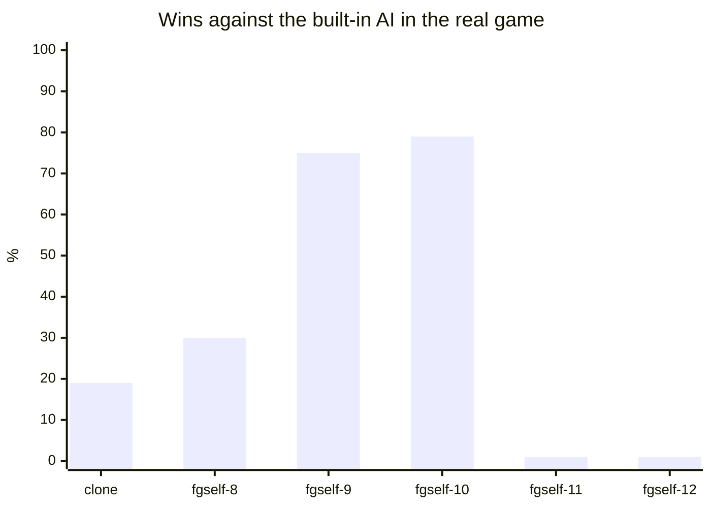

# Experiments

The main lessons, short. The [experiment log](reference/experiment-log.md) has the tables and the runs behind each one.

## Real-game win rate, whole game

The clone, `fgself-8`, `fgself-9` and `fgself-10` played `duelrush`. `fgself-11` and `fgself-12` played `duelfast`, with longer games and normal-speed combat.

## What worked

| lesson | evidence |
|---|---|
| Start from a clone of a good player. RL from scratch learns no team tactics. | micro: 58% → 91% from a fitted script |
| Keep the policy near the clone with a KL term. | without it, `fgself-7` became worse against the AI at once |
| Collect demonstrations from the policy's own states (DAgger). Use them as an extra loss, not as a fine-tune. | human and orc 5% → 37% |
| A curriculum against the AI: tax its income, not give the learner hit points or a late enemy. | a late enemy taught the learner to rush an idle AI |
| Compare per-game statistics (heroes, research, food) by game kind, not only win rates. | the reset bug: agents' games had 0.1 heroes |

## What went wrong

| problem | cause |
|---|---|
| Games between agents had no heroes for 9 runs | a scripted reset was not a new game. The engine kept counting removed heroes. |
| The `duelrush` policy kept rush habits on `duelfast` | its KL term held it to the rush policy |
| `duelfast` games end in ties | the policy banks its money and does not attack to win |
| RL lowers the chance of production and hero orders | all units of a step share one advantage, so rare orders get noisy credit |
