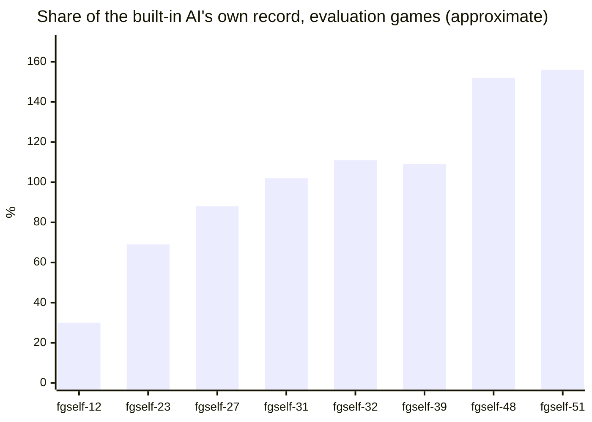
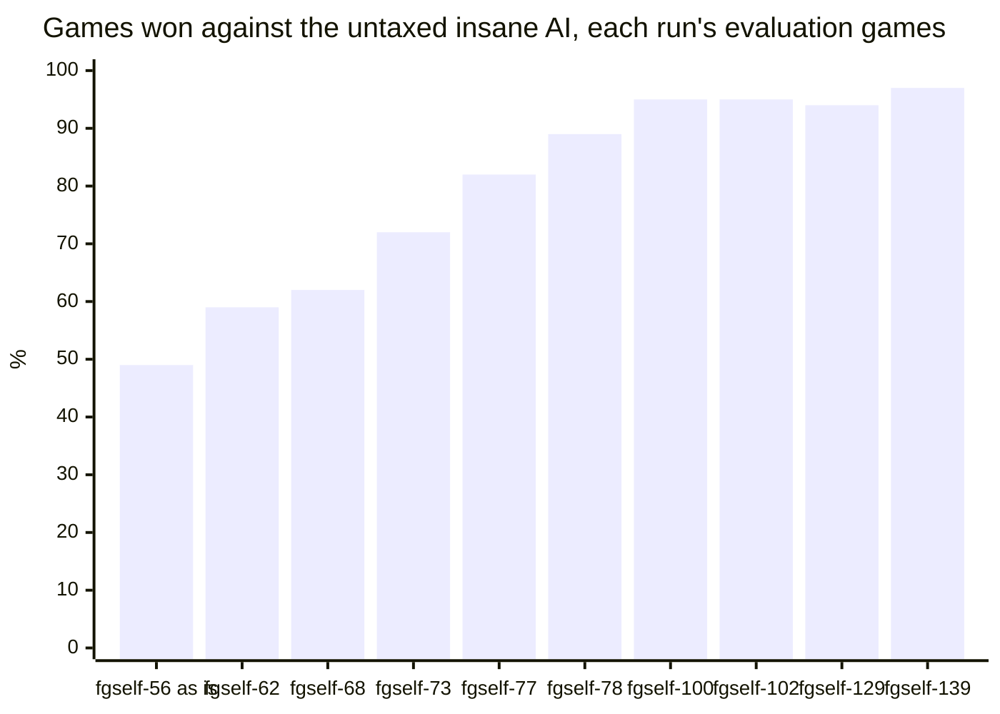

# Experiments

The main lessons, short. The [experiment log](reference/experiment-log.md) has every run, its numbers and why it ran. [Ideas](reference/ideas.md) lists every idea, where it came from (the user, the papers, LLM RL) and what became of it; [what AlphaStar and OpenAI Five found](reference/ideas-from-alphastar-and-openai-five.md) ranks the papers' findings.

Each experiment is a new run, forked from a checkpoint (`scripts/selfplay_fork.py`). The fork starts with its parent's league and gets a title of a few words (`--title`, `runs/<run>/summary.txt`). The dashboard's lineage shows the forks with their titles.

## The duelfast line

```mermaid
xychart-beta
  title "Share of the built-in AI's own record, evaluation games (approximate)"
  x-axis ["fgself-12", "fgself-23", "fgself-27", "fgself-31", "fgself-32", "fgself-39", "fgself-48", "fgself-51"]
  y-axis "%" 0 --> 170
  bar [30, 69, 88, 102, 111, 109, 152, 156]
```

100% is the built-in AI's own level in the same matchups. The runs measured different matchup mixes, so the bars are approximate.

## The real game on Echo Isles

```mermaid
xychart-beta
  title "Games won against the untaxed insane AI, each run's evaluation games"
  x-axis ["fgself-56 as is", "fgself-62", "fgself-68", "fgself-73", "fgself-77", "fgself-78", "fgself-100", "fgself-102", "fgself-129", "fgself-139"]
  y-axis "%" 0 --> 100
  bar [49, 59, 62, 72, 82, 89, 95, 95, 94, 97]
```

Each run plays its own matchups, so compare within a run: in `fgself-78`'s games its policy won 89% and its start 84%; in `fgself-100`'s, 95% to `fgself-78`'s 87%. A quarter of the KL's pull (`fgself-77`), strategy conditioning (`fgself-78`) and training on the fast rules toward targets the policy can follow (`fgself-100`) made the last gains. Since then the yardstick is spent (95-97%); games against frozen snapshots of the policy (`--eval-vs`, head to head) and a rating over all evaluation games (Bradley-Terry, the insane AI at 1500: the dashboard's Ratings) measure progress beside it, and the work turned to strategic variety: playing a given target build order (68% against insane with one, `fgself-139`).

## What worked

| change | head to head |
|---|---|
| Forward KL to the anchor over every action head (not reverse KL on the orders only) | 28% → 54% → 69% |
| Move the anchor to a recent checkpoint of the policy | +11 points, twice |
| Train against insane, not normal | insane 34% → 45% |
| UPGO (credit that a later bad action does not cancel) | 79% → 102% → 111% |
| No dropout in the updates (the actors play without it) | 93% → 109% |
| No advice and no cloning loss from the built-in AI, once the policy beats it | 137% → 152%, and 18% more steps a second |
| A deeper network (5 layers, grown from 3 so that it starts as the old one) | 148% → 156% |
| On Echo Isles: positions from the own base at the duel maps' scale | 0 → 49% of games against insane |
| A horizon for 25-minute games (γ 0.9997) | 55% → 59% of games |
| A wider search for a free building spot (up to 768 units) | undead's builds taken 25% → 79%, 57% → 62% of games |
| Half the reward shaping (the material lead), so the win weighs more | 62% → 72% of games, human 34% → 53%, undead 32% → 49% |
| A quarter of the anchor's pull (`--ref-kl 0.05`) | 72% → 82% |
| Target strategies (AlphaStar's z: build orders from the AI's games and people's replays) | 82% → 89% |
| Targets the policy can follow (a pool at its own rules' times, a builder that teaches from the tech tree, the next item's cost saved), trained on `echofast`, judged on the real game | 87% → 95%; ~80% of the due target items made by the policy itself |
| The anchor moved to the best checkpoint | no slide after the peak |
| More games as the weaker races (human and undead 35% each) | undead 79% → 89% |
| The game's rules made right (audits: the first hero free, purchases that go through, dead heroes revived, undead's haunted mine, a hall's tier while it trains workers) | level at first (`fgself-120`, `-122`); with the tier fix the best rating yet (`fgself-129`, ~1940 to 1875; tier 2 in 63% of real games) |
| Orders of the agent's own: expand to the natural, creep its camp (`--macros 1`) | `fgself-127` better (1874 to 1810), the first expansions in the real game |
| Targets not enforced (a side with a target may answer with items outside it) | with a target 24% → 58% against insane |
| A first hero taught in games without a target | human plays a hero again (`fgself-135`) |
| A hero's skill points spent when the policy leaves them (`--macros 3`) and a third audit's fixes | 51% head to head with its start (`fgself-137`) |
| Orders the game refuses not sent (repairs of what needs none, harvests at mines the race cannot mine, power builds without lumber) | 58% head to head with its start (`fgself-139`); 97% against insane |

## What did not help

* Larger learning rates (twice as large: worse, twice) and larger batches.
* Shaping for hero levels, credit per unit, a smaller unspent-money penalty, more real games in training.
* Sampling at temperature 0.8: the policy gave fewer orders and lost (71% against 136%).
* A clone of the AI's games under the real rules: it lost every game. Cloning undid the policy's fighting.
* A cloning loss on the AI's real games, all of them or undead's only: level at ×0.02, worse at ×0.1.
* More self-play (half the games against itself): worse. More training games as the weak races: level.
* Annealing the rules from duelfast to the real game: the policy did not need it.
* More reward for following the target (×2.5, ×5), a cloning loss toward the target, targets carried out by the harness, enforcement alone: the policy did not follow better on its own.
* An 8-layer network: level. GRPO from mid-game branches: level (creeps and the AI are not deterministic, ~55% of branches replay exactly).
* AlphaStar's league (self-play, past snapshots, a main exploiter; `fgself-103`), OpenAI Five's reward decay (`-104`), each sample used once (`-105`): level.
* Classifier-free guidance toward the target (`-106`, ×2): it followed no better and won 50% instead of 91%.
* The enemies it saw before as inputs (`fgself-107`, `-117`): worse. Rewards by part (GDPO, `-110`, `-116`): worse. Self-distillation with privileged information (OPSD, `-112`, `-121`): no gain. A weight soup of two runs (`-115`): level. Scenarios (armies between the bases, a raid, extra money; `-114`): level.
* Expansion taught with a lesson to clear the natural's camp (`-123`): armies dragged away, much worse; without it (`-124`) the policy built a second hall at home.
* The target's army mix taught a unit at a time (`-131`): level; an order to train it (`-132`): followed, at a cost in wins. Halfway rules between `echofast` and the real game (`echo50`, `-133`): worse.
* Items off the ground as an order (`--macros 2`, `-134`): it picks them up, but without a target the human policy built no altar, so had no hero.

## What went wrong

| problem | cause |
|---|---|
| Every fork measured the same evaluation games | a fixed seed. The seed now includes the run's name, and the policies play the same matchups. |
| Forks lost ~10 points in their first 20 minutes | a fresh Adam optimizer. Checkpoints now keep its state. |
| On Echo Isles the policy built in the trees and attacked mid-map | the map frame scaled positions to the map's size. The frame now keeps the base area and the enemy base where the duel maps had them. |
| Games between agents had no heroes for 9 runs | a scripted reset was not a new game |
| Forks lost their parent's league and swapped two spell toggles (`fgself-113`) | the vocabulary's order differed between processes |
| No tavern hero hired in thousands of games; the first hero held back until 425 gold | the tavern stands in the fog at the start (every buy refused); the mask did not know the first hero is free |
| No policy had ever expanded; dead heroes never revived; most of `echofast`'s creeps at full hit points | undead had no haunted mine order, the revival order was missing, the creeps' hit points were not scaled (audit, 2026-10-22) |
| The policy's tech held back for every race | a hall's tier order is refused while it trains workers |
| The real-game yardstick's AI record was the duel maps' until 2026-10-23 | the wrong table (audit 4) |
| 30-40% of the policy's orders refused by the game | repairs of what needed none, workers sent to mines their race cannot mine, a peasant's power build without lumber (audits 5 and 6, tested in the game) |
| The first hero the target's only by chance (25-37%) | in target games no lesson came before the policy had made another hero (`fgself-140` teaches it) |
