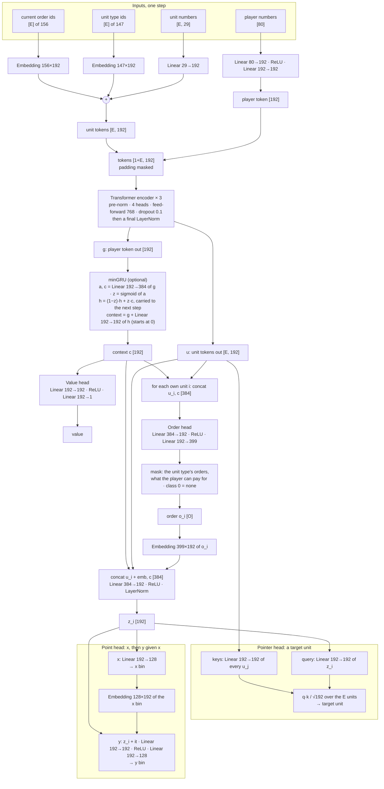
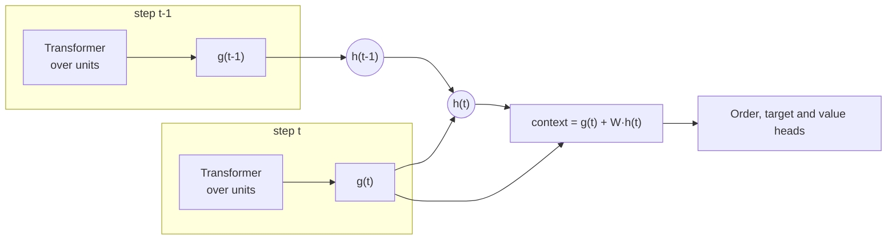

# The whole-game model

One network plays one side. It sees the game from its own player's view, as a set of tokens. Code: `fullgame/features.py` and `fullgame/model.py`.

## The full network

E is the number of units in view (at most 160). O is the number of own units (at most 96). Width d = 192.

* The tokens are a set. There is no position encoding: a unit's position is its x, y numbers.
* The order decides which target heads count: a unit (pointer), a point (x then y), or none.
* Each head samples with the Gumbel-max trick.

## Token channels

A unit token is the sum of three parts:

* a linear layer on 29 numbers (the table below),
* a learned vector for its unit type (147 types),
* a learned vector for its current order (156 orders).

| index | channel |
|---|---|
| 0, 1, 2 | side: own, enemy, neutral (as this player sees it) |
| 3, 4 | position x, y ÷ 3072 (x mirrored, so the own base is always on the left) |
| 5, 6 | hit points ÷ maximum, maximum ÷ 1000 |
| 7, 8 | mana ÷ maximum, maximum ÷ 1000 |
| 9 – 19 | flags: hero, building, worker, under construction, hidden, loaded, sleeping, paused, summoned, illusion, flying |
| 20 | hero level ÷ 10 |
| 21 | gold left in it (gold mines) ÷ 12,500 |
| 22 | unspent skill points ÷ 3 |
| 23, 24 | facing: sine, cosine (mirrored) |
| 25 | it has an order now |
| 26 | own building: units queued ÷ 5 |
| 27 | own building: it makes something now |
| 28 | own worker: sent to cut lumber |

The **player token** has 80 numbers:

| index | channel |
|---|---|
| 0 – 5 | gold ÷ 1000, lumber ÷ 1000, supply used ÷ 100, supply cap ÷ 100, upkeep ÷ 2, step number ÷ 1800 (steps of half a second) |
| 6 – 9 | own race: human, orc, undead, night elf (one-hot) |
| 10 – 13 | enemy race, the same |
| 14 – 79 | the player's level of each of 66 upgrades |

**How players differ:** only by the side channels. The view is always from "my" side, so "own" means this player. The two races sit in the player token. Position is the x, y numbers, not a token index. The transformer treats the units as a set, so their order does not matter.

## Memory (optional): a minGRU across steps

The transformer looks across units within one step. The minGRU looks across steps, on one vector: the player token's output `g`.

* Gate and candidate come from `g(t)` only: `z = sigmoid(A·g)`, `c = B·g`.
* The new state is `h(t) = (1 − z)·h(t−1) + z·c`.
* The gate does not read `h`, so training computes 16 steps at once with a parallel scan. The actors start each sequence from the state they stored.
* `W` starts at zero, so a new core changes nothing at first. In `fgself-12` its size grew from 0 to 2.2.

There are no tokens per time step and no time encoding. The order of the steps is the order of the recurrence. AlphaStar and OpenAI Five use the same split: a network over units at each step, then a recurrent core.

## Actions

* Every own unit gets its own order at every step (half a second).
* Masks allow only orders that the unit's type gave in the demonstrations, and that the player can pay for now.
* The chosen order goes into the target heads, so a target depends on its order.
* The action's log-probability is the order's plus the target heads that the order uses.
