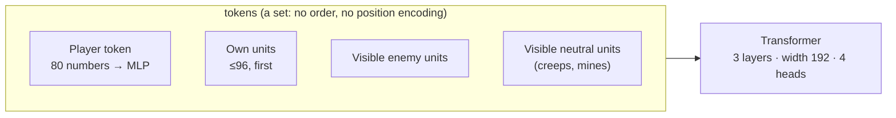
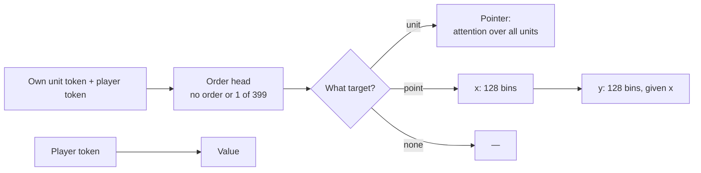

# The whole-game model

One network plays one side. It sees the game from its own player's view, as a set of tokens. Code: `fullgame/features.py` and `fullgame/model.py`.

## Tokens

## Transformer

* 3 encoder layers, width 192, 4 attention heads, feed-forward 768, pre-norm, dropout 0.1, and a final layer norm.
* Every token attends to every other token. A batch pads to its widest step, and attention ignores the padding.
* The player token's output feeds the value head and every unit's order head.

## Token channels

A unit token is the sum of three parts:

* a linear layer on 29 numbers (the table below),
* a learned vector for its unit type (147 types),
* a learned vector for its current order (156 orders).

| channels | numbers |
|---|---|
| side | 3: own, enemy, neutral (as this player sees it) |
| where | 2: x, y (mirrored, so the own base is always on the left) |
| health | 4: hit points and mana, each as a share and a maximum |
| what | 11 flags: hero, building, worker, constructing, flying, … |
| state | 6: hero level, gold in a mine, skill points, facing (2), has an order |
| own production | 3: queued, busy, worker on lumber |

The **player token** holds gold, lumber, supply, upkeep, game time, both races (one-hot each) and 66 upgrade levels.

**How players differ:** only by the side channels. The view is always from "my" side, so "own" means this player. The two races sit in the player token. Position is the x, y numbers, not a token index. The transformer treats the units as a set, so their order does not matter.

## Memory (optional)

A minGRU reads the player token at each step and adds its state back to it. It starts at zero, so it changes nothing at first.

## Actions

* Every own unit gets its own order at every step (half a second).
* Masks allow only orders that the unit's type gave in the demonstrations, and that the player can pay for now.
* The chosen order goes into the target heads, so a target depends on its order.
* The action's log-probability is the order's plus the target heads that the order uses.
