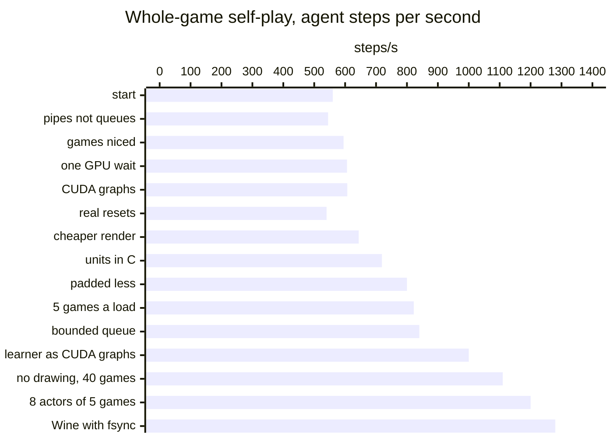
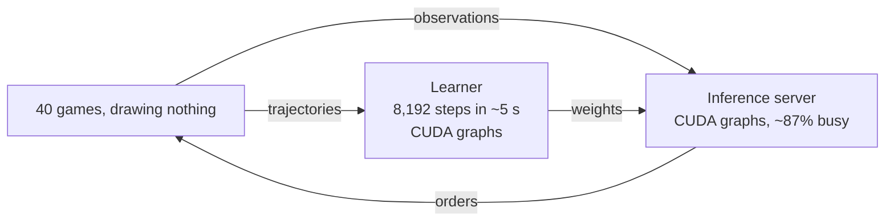

# Optimizations

The game's CPU sets the speed. The [optimization log](reference/optimization-log.md) has every fix with its numbers.

## Self-play throughput

## Where the time goes

* With 40 games a step was ~51 ms (2026-10-03, evening): ~20 ms waiting for the game, ~19 ms for the inference server (which shares the GPU with the learner), ~12 ms in the actor's Python (then 10 games shared one GIL). Since then the games' Wine overhead fell by about two thirds (threads asleep while waiting, fsync), actors have 5 games each, and the inference server's rounds fell from 12.5 to ~7.4 ms (CUDA streams, shared memory).
* The inference server is the limit again (~90% busy, ~3.5 ms of a round waiting for the GPU the learner uses).
* The learner is faster than the games: an update of 8,192 steps takes ~5 s (9.5 s before its CUDA graphs), and it waits 2–3 s for the next batch.

## The largest fixes

1. Orders and observations travel with the step sync, not through files.
2. The shim reads the units in C, not the map script in JASS.
3. Five games per map load, each with new players.
4. One inference server with CUDA graphs and one GPU wait per round.
5. The learner's minibatch steps as CUDA graphs: one launch where eager PyTorch made ~2,000.
6. The games draw nothing: the Direct3D device's draw calls return at once (17% less CPU a step, the same simulation).
7. While a game waits for its orders its background threads sleep, and Wine's gamepad drivers are not loaded (~22% less CPU a step).
8. GE-Proton's Wine with fsync: Wine's synchronization on futexes, not wineserver round trips (28% less CPU a step).
9. 8 actor processes of 5 games (13% more steps/s: each actor's games had waited for its GIL); the inference server's view steps through shared memory and its calls on CUDA streams (rounds 12.5 → 7.4 ms).

## What remains

* The inference server: it shares the GPU with the learner (a process each: they take turns). In the learner's process on a high-priority stream it would not wait for the learner's kernels.
* The learner's cloning loss: ~1/3 of an update for a ×0.02 term the distillation may make redundant (next experiment: without it).
* The actors' features in C (~40% of an actor's CPU).
* Other work on the machine: a headless Chrome from another project takes ~10 cores in bursts (throughput ~1,300 → ~1,000 steps/s while it runs).

* Longer steps on long games: about 1.4× more game time per CPU.
* The video renderer: 3.4 cores while it renders.
