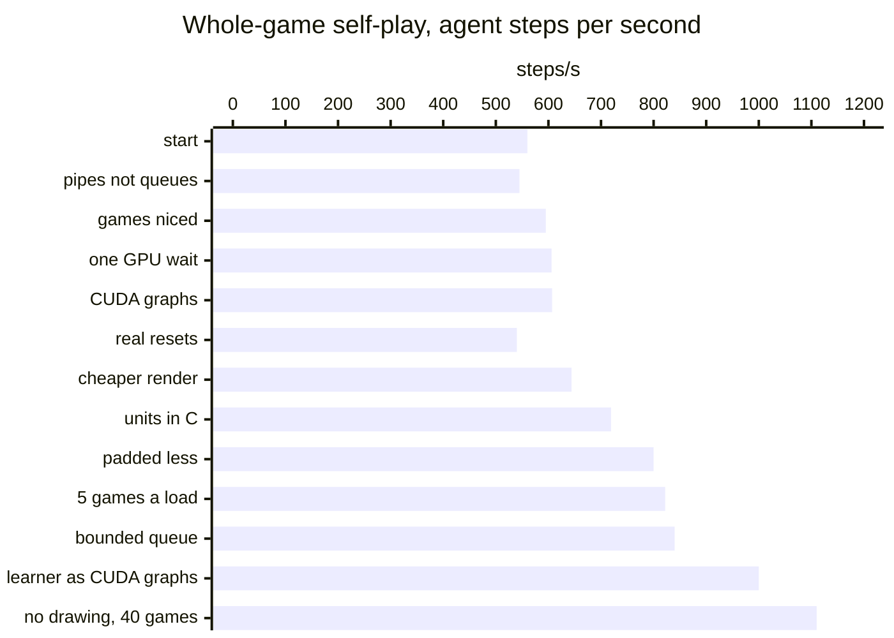
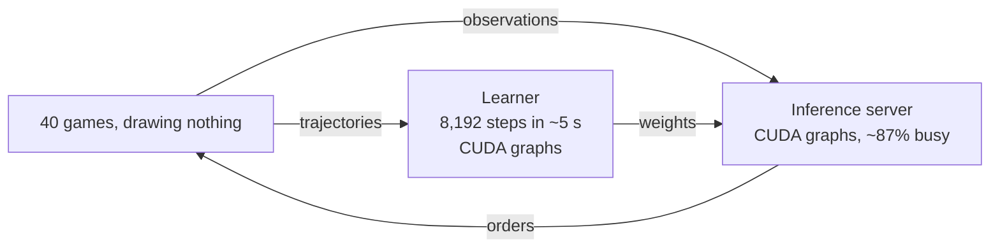

# Optimizations

The game's CPU sets the speed. The [optimization log](reference/optimization-log.md) has every fix with its numbers.

## Self-play throughput

## Where the time goes

* The games fill all 32 CPU threads. A step costs 14.6 ms alone and 35–40 ms with 32 games running.
* The learner is faster than the games: an update of 8,192 steps takes ~5 s (9.5 s before its CUDA graphs), and it waits 2–3 s for the next batch.

## The largest fixes

1. Orders and observations travel with the step sync, not through files.
2. The shim reads the units in C, not the map script in JASS.
3. Five games per map load, each with new players.
4. One inference server with CUDA graphs and one GPU wait per round.
5. The learner's minibatch steps as CUDA graphs: one launch where eager PyTorch made ~2,000.
6. The games draw nothing: the Direct3D device's draw calls return at once (17% less CPU a step, the same simulation).

## What remains

* Longer steps on long games: about 1.4× more game time per CPU.
* The video renderer: 3.4 cores while it renders.
