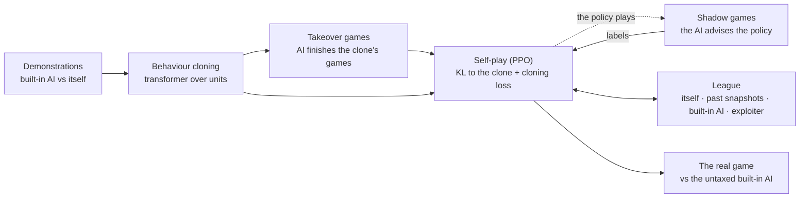

# Overview

warcraftsim trains agents on the real Warcraft III 1.29, headless under Wine. Python steps the game every half second of game time. The project reimplements nothing.

## Status

| track | best result | run |
|---|---|---|
| Micro fights | 91% against the scripted opponent. League self-play: 82%, and 79% against the 91% policy | `--trainer torch` |
| Whole game, `duelrush` (2-minute games) | **79%** against the built-in AI, all 16 matchups | `fgself-10` |
| Whole game, `duelfast` (6-minute games) | under 1%: it loses the real game in 5–10 minutes. Against the taxed AI 70% of games tie. | `fgself-12` (running) |
| The real game (Echo Isles) | not started | |

## How we make a whole-game agent

## Read next

* [Environments](environments.md): the maps, the opponents, what the agent sees and does.
* [The whole-game model](model.md): tokens, transformer, action heads.
* [Experiments](experiments.md): what worked and what did not.
* [The road to the real game](road-to-the-real-game.md): what is still missing.
* [Optimizations](optimizations.md): how a step became fast.
* [Architecture](architecture.md): how Python drives the game.
* Related work: [AlphaStar](related/alphastar.md), [OpenAI Five](related/openai-five.md) and [robot learning](related/robot-learning.md), and how this project differs.
