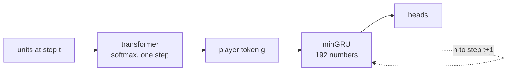
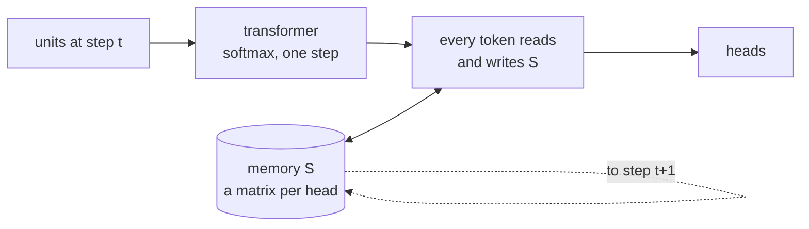

# Proposal: memory as linear attention

**Question.** Should the model be one linear-attention transformer over the units of all steps, instead of a transformer per step plus a minGRU?

**Answer.** Not a flat one. Keep softmax attention inside a step. Replace the minGRU with a linear-attention memory that every unit token reads and writes. Try it only after two cheaper steps (below).

## Today and the proposal

**Today**

**Proposal**

## Why not one flat linear-attention model

* Inside a step the units are a set. Softmax attention over ~45 tokens is cheap and exact. A flat causal sequence gives the units an order that means nothing.
* Linear attention finds a single exact item less well than softmax attention does. Inside a step, the policy needs exact choices, such as the target of an attack.

## Why the memory is better as linear attention

| | minGRU today | linear-attention memory |
|---|---|---|
| state | 192 numbers | a matrix per head and layer (~28,000 numbers) |
| writes | the player token only | every unit token |
| recall | a summary | one unit by its key: "the barracks I saw at x, y" |
| units out of sight | lost unless in the summary | kept until overwritten (delta rule, as in Gated DeltaNet) |
| training | parallel scan | chunked parallel form, one chunk a step |

## Costs and risks

* The inference server keeps ~110 KB of state per game instead of 768 bytes.
* A unit needs a stable key to overwrite its own memory. The game reuses unit ids after a unit dies.
* Memory has not helped yet. In cloning, order accuracy was 59.8–60.2% with memory and 61.4% without it.
* Today's problems (ties, money not spent, rare orders) are not memory problems.

## Plan

1. **Last-seen tokens, no model change.** Keep each enemy unit and building as a token with its last position and age. The game's own "ghosts" do the same.
2. **Compare in cloning on `duelfast`:** minGRU against the linear-attention memory. Measure the validation loss at steps where enemies are out of sight.
3. **RL** only if step 2 shows a clear gain.
