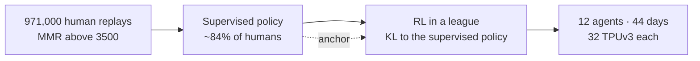
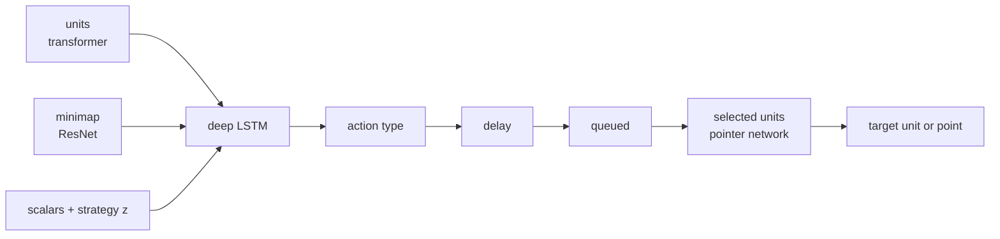

# AlphaStar (StarCraft II)

DeepMind, Nature 2019. The first agent to reach Grandmaster in StarCraft II, with all three races, ranked above 99.8% of active players on Battle.net. It played under human-like limits: a camera view and at most 22 actions per 5 seconds.

## How DeepMind made it

## The network

* **One action per decision**, built step by step: what to do, when to act next, which units, and where.
* **The delay head** chooses when to act next. The agent does not act at every game step.
* **Strategy z**: a build order and unit counts from a human game. Extra rewards keep the agent near z, so the league keeps many strategies alive.
* 139 million weights. Acting uses 55 million of them.

## The league

| agent | count | plays against | purpose |
|---|---|---|---|
| main agent | 3 (one per race) | itself, past league members (PFSP) | the final agent |
| main exploiter | 3 | the current main agents | find their weaknesses |
| league exploiter | 6 | the whole league (PFSP) | find weaknesses of the league |

RL: actor-critic with V-trace, TD(λ) and UPGO, a new self-imitation update.

## What we took, and where we differ

| | AlphaStar | warcraftsim |
|---|---|---|
| start | 971,000 human replays | the built-in AI's games |
| anchor | KL to the supervised policy | the same |
| fine-tune on wins | winning replays with MMR above 6,200 | the winners of games decided within 6 minutes |
| league | main agents, exploiters, PFSP | the same idea, with one optional main exploiter |
| actions | one command for selected units, with a delay | an order for every unit, every half second |
| inputs | units, minimap, scalars | units and scalars, no map |
| compute | 12 agents × 32 TPUs × 44 days | one RTX 3090 and 16 cores |

## Changing the anchor

AlphaStar keeps its anchor for the whole run. Exploiters restart from the supervised policy. Main agents never restart. Other work moves the anchor:

| work | how the anchor moves |
|---|---|
| DeepNash (Stratego, 2022, [2206.15378](https://arxiv.org/abs/2206.15378)) | After each phase, the policy becomes the new anchor. The change is gradual over the next phase. |
| ProRL (language models, 2025, [2505.24864](https://arxiv.org/abs/2505.24864)) | When the KL term dominates the loss, the anchor becomes a recent policy. |
| TR-DPO (language models, 2024, [2404.09656](https://arxiv.org/abs/2404.09656)) | The anchor follows the policy: a moving average, or a copy at intervals. |
| PPO, TRPO | The anchor is the last policy, at every update. |

`fgself-12` changed its anchor to a better clone, not to itself. Its distance to the new anchor stayed at 0.002–0.004 a unit, the same as to the old one.
