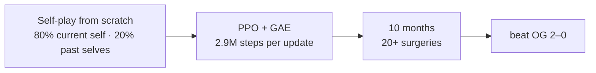
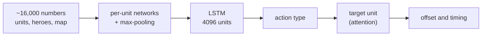

# OpenAI Five (Dota 2)

OpenAI, 2019. The first AI to defeat the world champions at an esports game: it beat Team OG 2–0 in April 2019. In a public arena it won 99.4% of 7,257 games against 3,193 teams. It learned by self-play only, with no human data.

## How OpenAI made it

* **Surgery**: when the game or the model changed, they converted the trained network to the new version and kept the same behaviour. Training went on for 10 months without a restart.
* **Rewards**: a win, plus kills, deaths, gold, experience and more. Each hero's reward blends with the team's ("team spirit", raised from 0.3 to 1.0 over training). Each team's reward subtracts the other team's.
* **Compute at the peak**: up to 1,536 GPUs for the optimizer, 1,440 for rollouts and 172,800 CPU cores. A clean rerun took 2 months.

## The network

* **One copy of the network per hero.** The five copies share the same weights. Each copy acts for its own hero.
* **An action every 4 frames**, about 7.5 actions per second, about 20,000 steps per game.
* 159 million weights. The LSTM has 84% of them.
* Scripts, not the network, chose the order of item and skill purchases, controlled the courier, and chose which items a hero keeps in reserve.
* Restrictions: 17 of 117 heroes, and no items that control more than one unit.

## What we took, and where we differ

| | OpenAI Five | warcraftsim |
|---|---|---|
| start | random weights, self-play | a clone of the built-in AI |
| control | one network copy per hero | one network for all units of a player |
| actions | one per hero, every 4 frames | one per unit, every half second |
| rewards | shaped (kills, gold, experience) | win, and the material lead as shaping |
| opponents | 80% itself, 20% past selves | itself, past snapshots, the built-in AI |
| surgery | 20+ in 10 months | a new memory core or new inputs start at zero |
| compute | up to 1,536 + 1,440 GPUs | one RTX 3090 |
