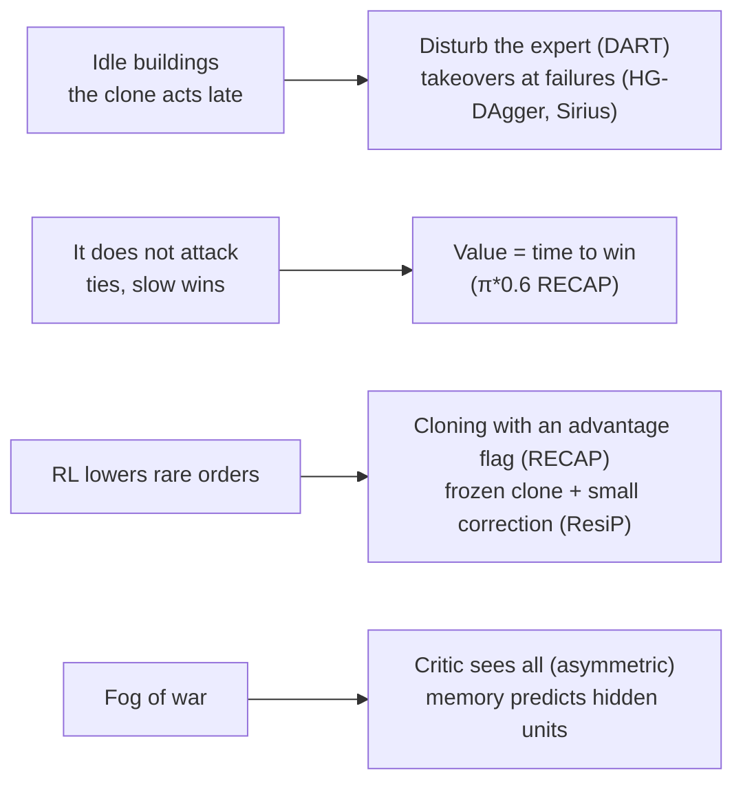

# Robot learning

Robot learning has our problem: clone an expert, then improve the clone with RL. This page lists the ideas from 2017–2025 that fit our open problems.

## Our problems and the ideas

| idea | source | what it does | for us |
|---|---|---|---|
| Disturb the expert | DART, 2017 ([1703.09327](https://arxiv.org/abs/1703.09327)) | Noise in the expert's play. The data then shows how the expert recovers. | Cancel the AI's queues at random in demonstration games. |
| Takeovers at failures | HG-DAgger, 2019 ([1810.02890](https://arxiv.org/abs/1810.02890)), Sirius, 2023 ([2211.08416](https://arxiv.org/abs/2211.08416)) | The expert takes over when the robot fails, then gives control back. Sirius gives these steps more weight. | Take over when a building stays idle with money. Weight the first steps after a takeover. |
| Value = time to win | π\*0.6 RECAP, 2025 ([2511.14759](https://arxiv.org/abs/2511.14759)) | The value predicts the steps until success. A delay costs reward. | Replace the tie's reward for a material lead. |
| Advantage flag | π\*0.6 RECAP, 2025 | Supervised learning on all data with a flag "good" or "bad". The robot acts with "good". | Learn from lost games too. Rare orders keep their data frequency. |
| Frozen clone + correction | ResiP, 2024 ([2407.16677](https://arxiv.org/abs/2407.16677)) | RL learns only a small change on top of the frozen clone. | Another way to keep the clone's production orders. |
| Asymmetric critic | Pinto et al., 2017 ([1710.06542](https://arxiv.org/abs/1710.06542)) | The critic sees the full state. The actor sees its sensors. | The value sees the units in the fog. The data has them. |
| Memory predicts the hidden state | Miki et al., 2022 ([2201.08117](https://arxiv.org/abs/2201.08117)) | The memory also learns to reconstruct what the sensors miss. | Predict the enemy army and buildings in the fog. |
| Action chunks | ACT, 2023 ([2304.13705](https://arxiv.org/abs/2304.13705)) | Predict the next k actions. One-step policies stall at pauses in the data. | The same symptom as our idle buildings. |

## What does not fit

* **Vision-language-action models** (RT-2, OpenVLA, π0): their strength is a pretrained image and language model. We have no images, and a 7B model is too slow for 850 steps a second.
* **Diffusion and flow policies**: they model continuous actions. Our orders are classes.
* **Off-policy Q-learning** (RLPD, Cal-QL, Q-chunking): a Q-function over the orders of all units is hard to learn. Our cloning loss already mixes the demonstrations into RL.
